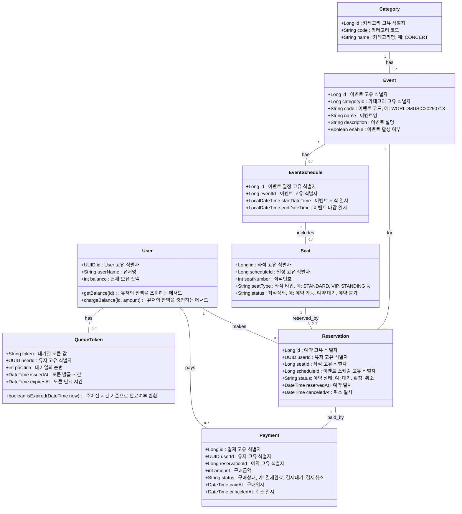
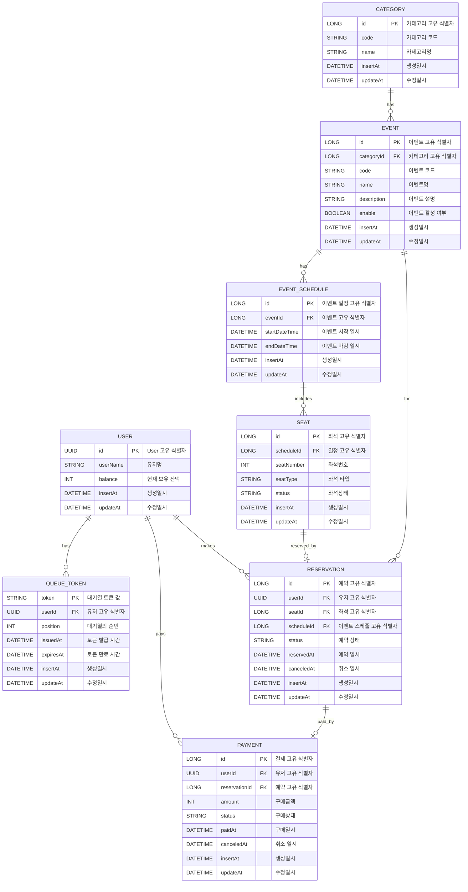
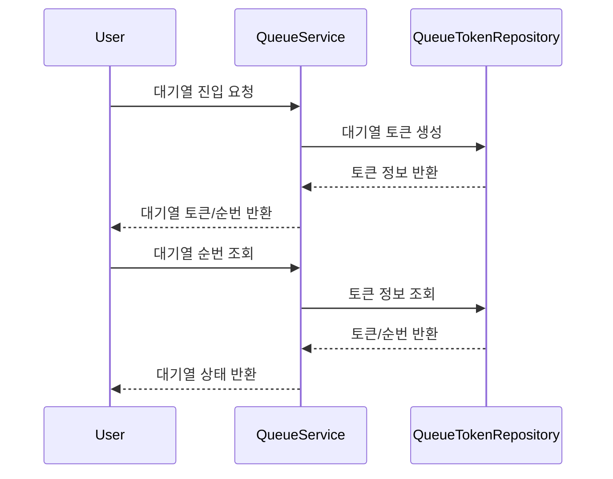
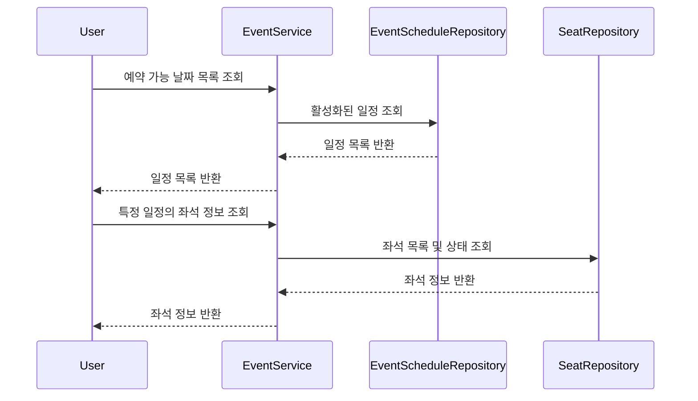
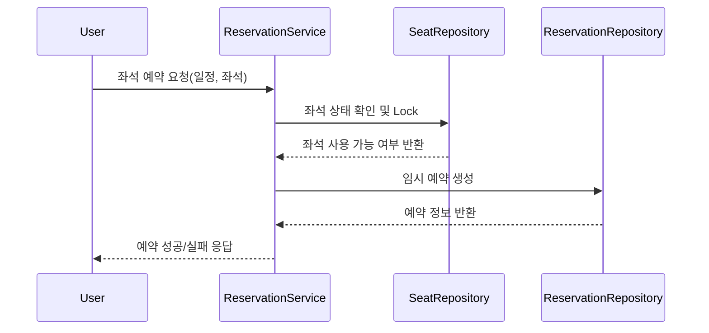
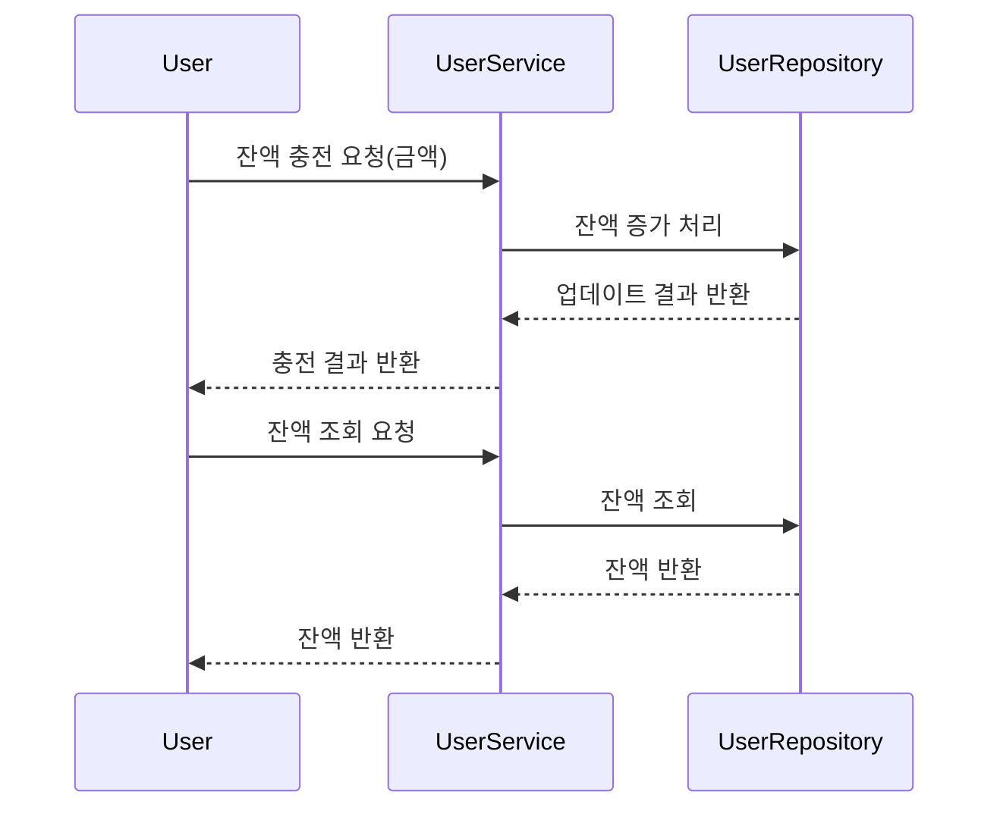
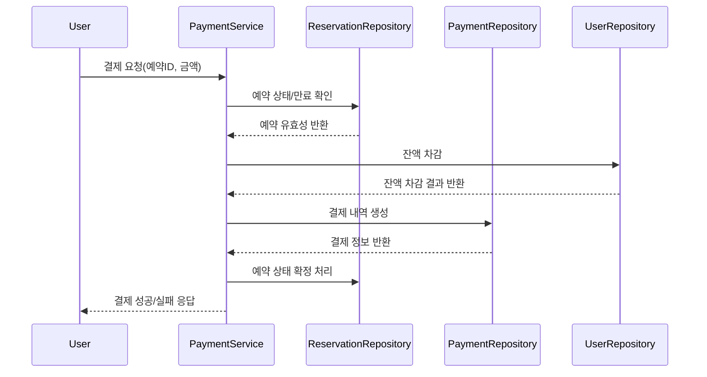

# Ticketing-platform

## 소개
이 저장소는 이벤트 티켓 예매 시스템 서버 백엔드 프로젝트입니다.

## 목차
- [클래스 다이어그램](#클래스-다이어그램)
- [ERD](#erd)
- [시퀀스 다이어그램](#시퀀스-다이어그램)

## 클래스 다이어그램

## ERD

## 시퀀스 다이어그램
1. 대기열 토큰 발급 및 대기열 조회

2. 예약 가능 날짜/좌석 조회

3. 좌석 예약 요청

4. 잔액 충전/조회

5. 결제 처리

