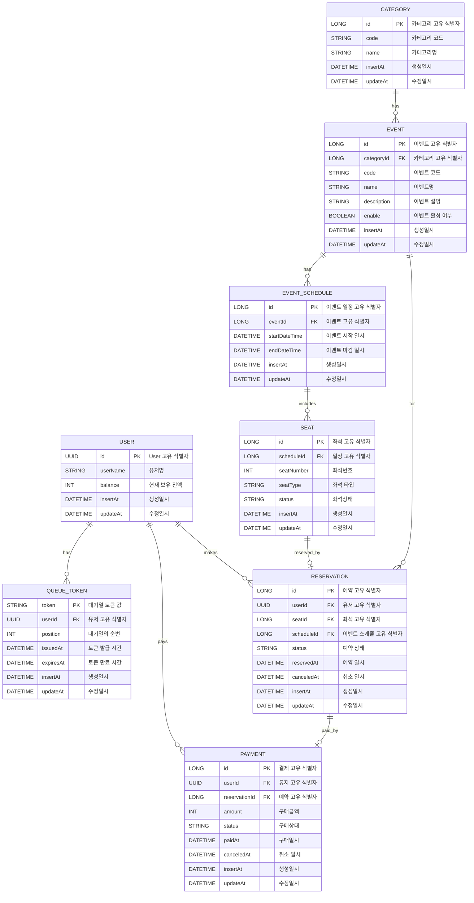
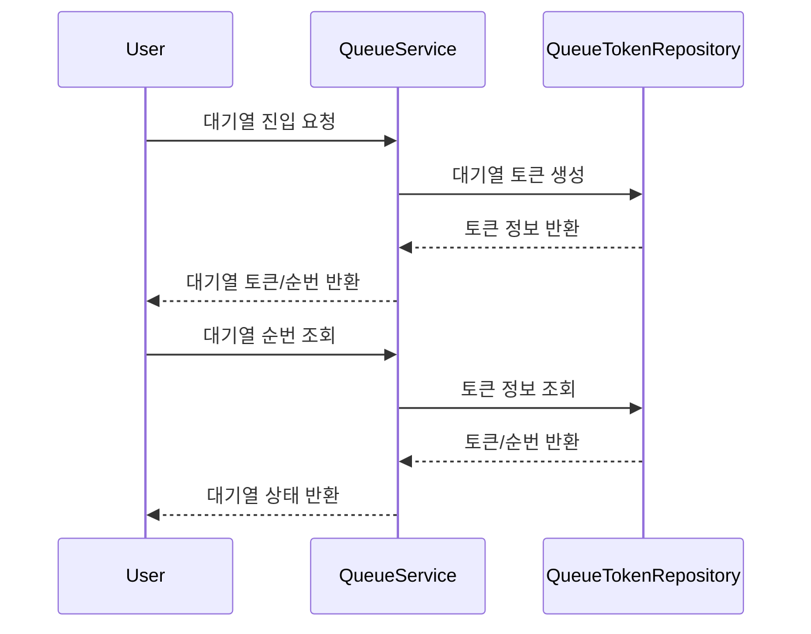
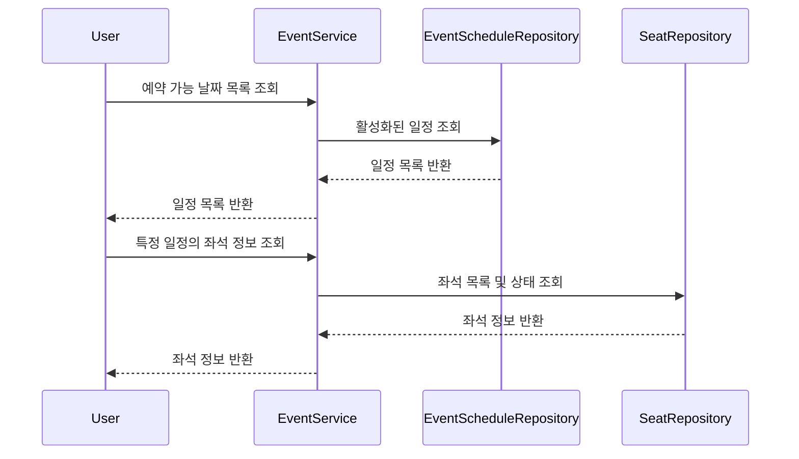
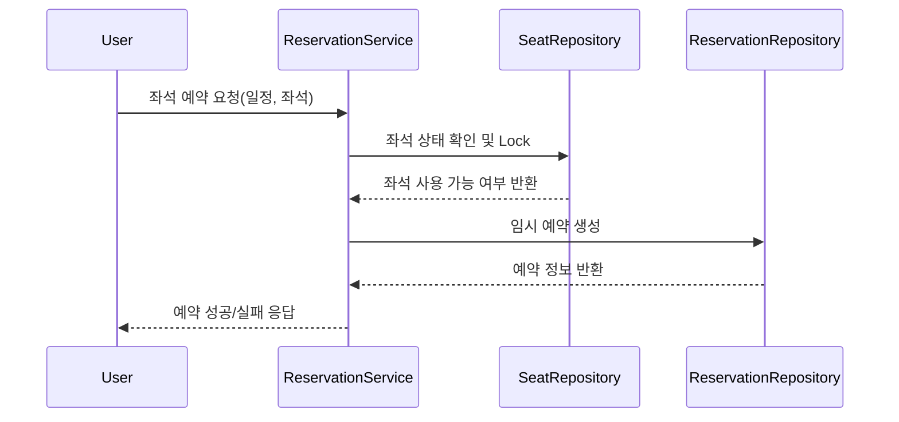
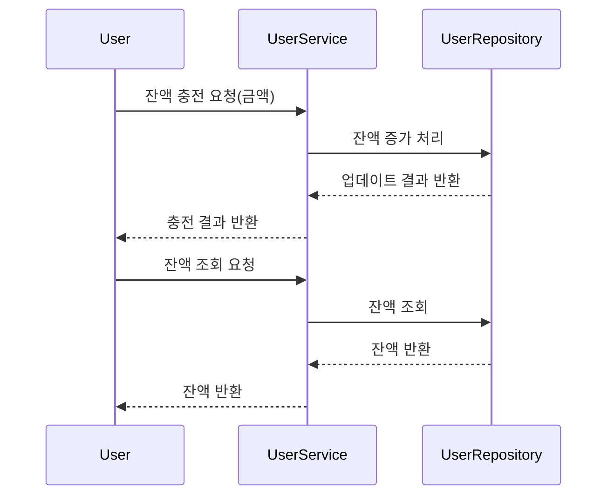
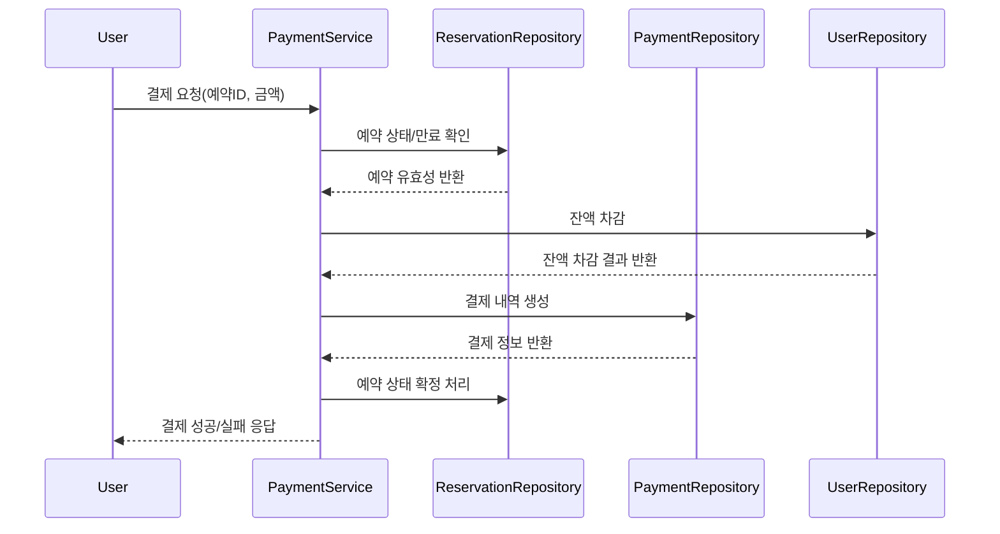

# Ticketing-platform

## 소개
이 저장소는 이벤트 티켓 예매 시스템 서버 백엔드 프로젝트입니다.

## 목차
- [요구사항 분석](#요구사항-분석)
- [클래스 다이어그램](#클래스-다이어그램)
- [ERD](#erd)
- [시퀀스 다이어그램](#시퀀스-다이어그램)

## 요구사항 분석
### **1.1. 유저 대기열 토큰 관리**

- **토큰 발급 API**
    - 사용자는 서비스 이용 전 대기열 토큰을 발급받아야 한다.
    - 토큰에는 사용자 UUID, 대기 순서, 발급/만료 시간 등 정보가 포함된다.
- **대기번호 조회 API**
    - 사용자 토큰을 통해 자신의 대기 순서를 확인할 수 있다.
    - 모든 서비스 API는 유효한 토큰이 있어야 접근 가능하다.
- **대기열 정책**
    - 대기열은 FIFO(First-In-First-Out)로 동작한다.
    - 대기열 상태는 폴링 방식으로 확인한다.
        - 폴링 방식 말고 더 나은 방식있다면 대체할 수도 있다.

### **1.2. 예약 가능 날짜/좌석 조회**

- **예약 가능 날짜 조회 API**
    - 예약 가능한 콘서트 날짜 리스트를 반환한다.
    - 날짜별로 예약 가능한 좌석 수, 잔여 좌석 정보 포함
- **예약 가능 좌석 조회 API**
    - 특정 날짜를 입력받아 해당 날짜의 예약 가능한 좌석 번호들을 반환한다.
    - 좌석별 상태(예약 가능, 예약 불가)를 함께 제공한다.

### **1.3. 좌석 예약 요청 및 임시 배정**

- **좌석 예약 요청 API**
    - 사용자, 날짜, 좌석 번호, 토큰 정보를 입력받아 예약 요청을 처리한다.
    - 좌석은 예약 요청 시점부터 약 5분(정책에 따라 조정 가능)간 임시 배정된다.
    - 임시 배정 시간 내 결제가 완료되지 않으면 자동으로 임시 배정 해제.
    - 임시 배정 중인 좌석은 다른 사용자가 예약할 수 없다.
    - 동시성 이슈 방지를 위해 분산락, DB 트랜잭션 락
- **임시 배정 상태 관리**
    - 임시 배정 상태, 시작/만료 시간, 해당 사용자 정보 저장.
    - 임시 배정 만료 시 자동 해제(스케줄러, 만료 체크 등 필요).

### **1.4. 잔액 충전 및 조회**

- **잔액 충전 API**
    - 사용자 식별자와 충전 금액을 입력받아 잔액을 충전한다.
    - 충전 내역은 이력으로 저장한다.
- **잔액 조회 API**
    - 사용자 식별자를 입력받아 현재 잔액을 조회한다.

### **1.5. 결제 및 예약 확정**

- **결제 API**
    - 예약 ID, 토큰을 입력받아 결제 요청을 처리한다.
    - 결제 시 사용자 잔액에서 금액 차감, 결제 내역 생성.
    - 결제 완료 시 좌석 예약이 확정되고, 임시 배정이 해제된다.
    - 결제 실패 시(잔액 부족 등) 적절한 오류 반환.
    - 결제 완료 시 대기열 토큰 만료 처리.
- **결제 내역 관리**
    - 결제 금액, 결제 시간, 결제 상태(성공/실패) 등 저장.

### **1.6. 동시성 및 대기열 정책**

- 여러 사용자가 동시에 사용하더라도 좌석 중복 예약, 대기열 순서 꼬임 등이 발생하지 않도록 동시성 제어 필수
- 분산 환경에서의 데이터 일관성 확보를 위한 설계 필요

### **2. 비즈니스 규칙 및 정책**

- **좌석 번호:** 1~50번, 날짜별로 관리
- **임시 배정 시간:** 기본 5분(정책에 따라 조정 가능)
- **대기열 정책:** 선착순, 토큰 만료 시 삭제 및 무시
- **잔액 부족 시:** 결제 불가, 임시 배정 해제
- **결제 완료 시:** 좌석 소유권 사용자에게 귀속, 대기열 토큰 만료

### **3. 예외 및 에러 처리**

- 유효하지 않은 토큰, 만료된 토큰 접근 시: 인증 에러 반환
- 좌석 임시 배정 중복 요청 시: 예약 불가 에러 반환
- 잔액 부족 시: 결제 실패 에러 반환
- 임시 배정 만료 후 결제 시도: 예약 만료 에러 반환
- 기타 예상치 못한 시스템 오류: 공통 에러 코드 및 메시지 정의

## 클래스 다이어그램

## ERD

## 시퀀스 다이어그램
1. 대기열 토큰 발급 및 대기열 조회

2. 예약 가능 날짜/좌석 조회

3. 좌석 예약 요청

4. 잔액 충전/조회

5. 결제 처리

